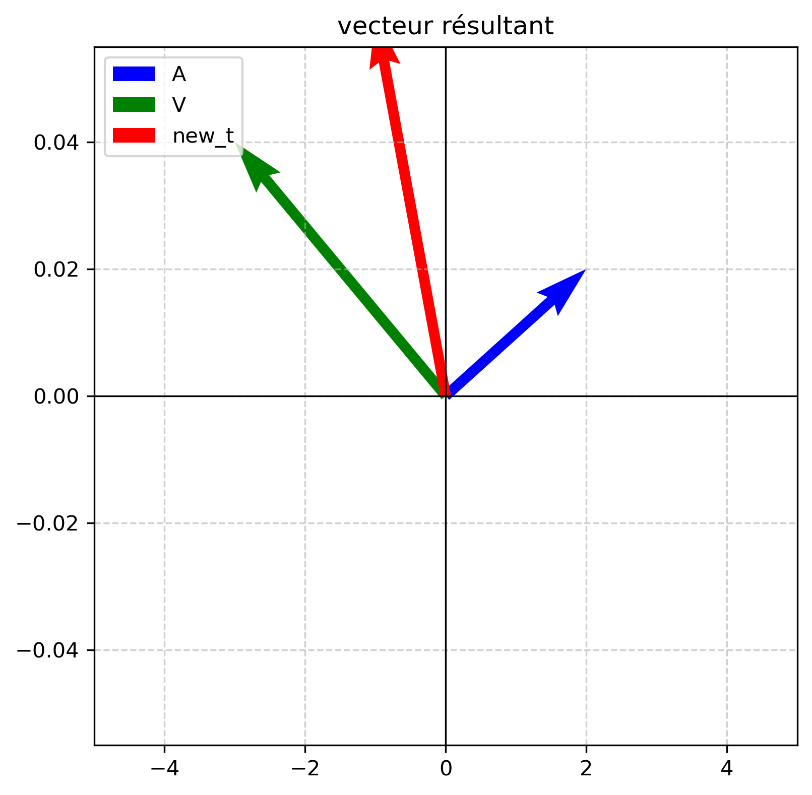

# maths-for-research
My logbook for the numerical implementation of linear algebra and probability concepts
## 01.Algebre lineaire 
###Linear Combinations and Vector Addition 
sum of two vectors $A(2,0.02)$ and $V(-3,0.04)$

